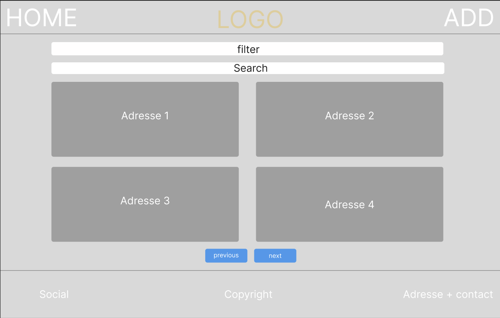

# **Documentation**

## **Installer et utiliser**

Pour installer et utiliser le site, suivez les étapes suivantes :

1. **Cloner le dépôt**

Commencez par cloner le dépôt GitHub en utilisant la commande suivante :

```bash
git clone https://github.com/votre-username/votre-depot.git
```

2. **Installer des dépendances**

```bash
npm install
```

3. **Lancer le serveur de développement**

```bash
npm run dev
```

4. **Visualiser dans son navigateur**

```bash
http://localhost:3000/
```

## **Maquette, Pages et Organisation**

### **Maquette**

Pendant la phase initiale du projet, j'ai réalisé une maquette pour visualiser le concept graphique du site une fois terminé. Cette maquette m'a permis d'anticiper les éventuelles difficultés et de commencer à planifier le nombre de pages nécessaires pour le projet.



Cette maquette est le premier concept que j'ai réalisé pour le site. Elle m'a permis de visualiser le design et la structure du site avant de commencer le développement.

### **Pages**

- [Accueil](src/pages/index.jsx)
- [Ajout](src/pages/ajout.jsx)
- [Header](src/pages/header.jsx)
- [Footer](src/pages/footer.jsx)

Ces pages sont les principales pages du site. L'Accueil est la page d'accueil du site celle ci permet d'afficher, afficher le détail, modifier et même supprimer la moindre adresse contenu dans la base de donnée, le Header est la barre de navigation qui apparaît en haut de chaque page, et le Footer est le pied de page qui apparaît en bas de chaque page.

### **Organisation**

Pour organiser mon travail, j'ai créé un calendrier de projet et une liste de tâches à réaliser. J'ai également utilisé Trello pour suivre l'avancement du projet et identifier les tâches à réaliser.

J'ai essayé de prioriser les tâches obligatoires et celles qui me paraissaient plus facilement réalisables en fonction de mes compétences.

## **Contenu**

#### **Accueil**

La page [Accueil](src/pages/index.jsx) affiche la liste des adresses stockées dans la base de données.

Lorsque l'utilisateur accède à cette page, il se retrouve nez à nez avec la liste des adresses. L'utilisateur peut filtrer la liste des adresses en fonction du type (restaurant, musée, bar, parc) et rechercher une adresse en fonction du nom, de la ville ou du code postal.

Lorsque l'utilisateur clique sur une adresse, un petit volet s'ouvre affichant le détail et lui permettant de mofifier une adresse. Si l'utilisateur clique sur le bouton "Supprimer", l'adresse est supprimée de la base de données.

#### **Ajout**

La page [Ajout](src/pages/ajout.jsx) permet d'ajouter une nouvelle adresse à la base de données MongoDB. Elle est accessible via la Nav bar en cliquant sur le petit logo en forme de +.

Lorsque l'utilisateur accède à cette page, il se retrouve face à un formulaire contenant les champs suivants :

-Type de lieu (l'utilisateur à le choix entre plusieurs types de lieu.)
-Nom du lieu (l'utilisateur entre une donnée)
-Adresse (l'utilisateur entre une donnée)
-Ville (l'utilisateur entre une donnée)  
-Code Postal (l'utilisateur entre une donnée)
-Pays (l'utilisateur entre une donnée)

Si l'utilisateur quitte un champ alors il aura un petit message en rouge pour l'avertir de son péché.

#### **Header**

Le Header est la barre de navigation qui apparaît en haut de chaque page puisqu'elle a été configuré de la sorte dans le [Fichier](src/pages/_app.js). Il contient les liens vers la page principale du site, la page d'ajout ainsi que le logo du site.

#### **Footer**

Le Footer est le pied de page qui apparaît en bas de chaque page. Il contient les informations de contact, les liens vers les réseaux sociaux et les mentions légales du site.

## **Mes fonctionnalitées**

- Ajout d'adresses dans une base de donnée
- Modifications d'adresses/ Suppression d'adresses
- Filtre de recherche
- Recherche dans la base de donnée
